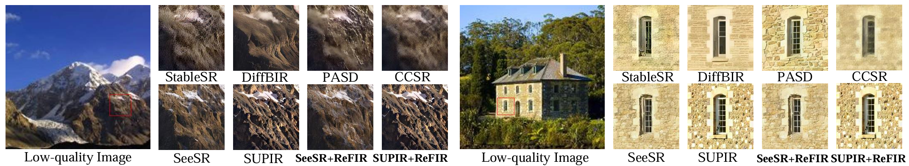

# ReFIR: Grounding Large Restoration Models with Retrieval Augmentation

### [[Paper](https://arxiv.org/pdf/2410.05601)]

[Hang Guo](https://csguoh.github.io/)<sup>1</sup> | [Tao Dai](https://scholar.google.com/citations?user=MqJNdaAAAAAJ&hl=zh-CN)<sup>2</sup> | [Zhihao Ouyang]()<sup>3</sup> | [Taolin Zhang](https://scholar.google.com.hk/citations?user=DWnu_G0AAAAJ&hl=zh-CN) <sup>1</sup> | [Yaohua Zha](https://scholar.google.com.hk/citations?user=-zUO4_QAAAAJ&hl=zh-CN)<sup>1</sup> | [ Bin Chen](https://scholar.google.com.hk/citations?user=Yl0wv7AAAAAJ&hl=zh-CN)<sup>4</sup> | [Shu-Tao Xia](https://scholar.google.com.hk/citations?user=koAXTXgAAAAJ&hl=zh-CN)<sup>1,5</sup>

<sup>1</sup>Tsinghua University, <sup>2</sup>Shenzhen University, <sup>3</sup>Aitist.ai, <sup>4</sup>Harbin Institute of Technology  <sup>5</sup>Pengcheng Laboratory 


:star: If ReFIR is helpful to your images or projects, please help star this repo. Thanks! :hugs:


## TL; DR
> Recent advances in diffusion-based Large Restoration Models (LRMs) often suffer from the hallucination dilemma, i.e., producing incorrect contents or textures when dealing with severe degradations, due to their heavy reliance on limited internal knowledge. In this paper, we propose an orthogonal solution called the Retrieval-augmented Framework for Image Restoration (ReFIR), which incorporates retrieved images as external knowledge to extend the knowledge boundary of existing LRMs in generating details faithful to the original scene. Extensive experiments demonstrate that ReFIR can achieve not only high-fidelity but also realistic restoration results. Importantly, our ReFIR requires no training and is adaptable to various LRMs.

<p align="center">
    
</p>


## 🔎 Overview framework

<p align="center">
    
</p>


## 📷 Real-World Results


<p align="center">
    
</p>

<p align="center">
    
</p>


## ⚙️ Dependencies and Installation

### Step1 Download and Environment

```
## git clone this repository
git clone https://github.com/csguoh/ReFIR.git
cd ./ReFIR

# create a conda environment
conda env create -f environment.yaml
conda activate ReFIR
```

**[NOTE]** We apply the proposed ReFIR to two DM-based SR methods, i.e., SeeSR and SUPIR. You can choose your favorite model for the following testing.


### Step2 Check GPU Requirement
- Please be noted that the standard testing protocol for reproducing the paper results costs up-to 40G GPU memory with 2048x2048 input resolution, so one GPU with 48G memory can works fine. 
- It may need some image tile/patch tricks for saving the GPU memory if you want to test this large input size. However, in most cases, we donnot need such large input resolution, and we have tesetd our ReFIR-SeeSR can cost about 19G when input resolution is 512x512, which can satisfy most needs. Also, you can even set the upscale=1, and the output will have the same size as input but with more clear shape and edges. 


### Step3 Prepare Dataset for testing

We consider two types of testing scenarios:

**[1. Restoration with Ideal Reference]**

- We use the classic refsr datasets for this setup, including [CUFED5](https://drive.google.com/file/d/1_eOcsgUrAOoUeCQqftruIatFHfVzTzOY/view?usp=drive_link) and [WR-SR](https://drive.google.com/file/d/1t41safv1IiulsFH_zLlxGsgzt8JmRtjR/view?usp=drive_link) dataset. 
- We apply the real-world degradation from Real-ESRGAN to obtain the LQ images
- You can download the pre-processed CUFED5 and WR-SR dataset with this link.
  

**[2. Restoration in the Wild]**

- We use the RealPhoto60 which is obtained from real-world and have no corresponding GT for this setting.
- You can download RealPhoto60 using this link.
- Additionally, you may also need to download the DIV2K dataset as the retrieval database.


## 🚀 Inference with SeeSR model

The technical details of SeeSR can be found in [this repo](https://github.com/cswry/SeeSR)

#### Step 1: Download the pretrained models
- Download the pretrained SD-2-base models from [HuggingFace](https://huggingface.co/stabilityai/stable-diffusion-2-base).
- Download the SeeSR and DAPE models from [GoogleDrive](https://drive.google.com/drive/folders/12HXrRGEXUAnmHRaf0bIn-S8XSK4Ku0JO?usp=drive_link) or [OneDrive](https://connectpolyu-my.sharepoint.com/:f:/g/personal/22042244r_connect_polyu_hk/EiUmSfWRmQFNiTGJWs7rOx0BpZn2xhoKN6tXFmTSGJ4Jfw?e=RdLbvg).
- After downloading the ckpt, you may also modify the load path in the `test_real.py` and`test_retrieve.py`

#### Step 2: Running testing command

```
# evaluate on refsr dataset
cd ./seesr
python ./test_real.py --image_path <test image floder path> --output_dir <path to save the results> --refir_scale 0.6
```

If you  want to evaluate on the RealPhoto60 dataset, you may first retrieve in the HQ database.

```
# evaluate on realphoto60 dataset
# 1. construct the retrival database (this process need only once)
python construct_vecbase.py
python retrieve_img.py

# 2. run resotration process
cd ./seesr
python ./test_retrieve.py --image_path <test image floder path> --output_dir <path to save the results> --refir_scale 1.0
```


#### Step 3: Evaluate the restoration results

```
# back to the main path
cd ..

# run the rvaluation code 
# 1. if you want to evaluate on refsr dataset, then run
python cal_iqa.py --img_path <the model output path> --gt_path <ground truth path>

# 2. if you want to evaluate on realphoto dataset, then run
python cal_iqa_nr.py --img_path <the model output path>
```


## 🌈 Inference with SUPIR model

#### Step1: Download the pretrained models

The required ckpt for SUPIR is a little large, we provide the ckpt list bellow.
* [SDXL CLIP Encoder-1](https://huggingface.co/openai/clip-vit-large-patch14)
* [SDXL CLIP Encoder-2](https://huggingface.co/laion/CLIP-ViT-bigG-14-laion2B-39B-b160k)
* [SDXL base 1.0_0.9vae](https://huggingface.co/stabilityai/stable-diffusion-xl-base-1.0/blob/main/sd_xl_base_1.0_0.9vae.safetensors)
* [LLaVA CLIP](https://huggingface.co/openai/clip-vit-large-patch14-336)
* [LLaVA v1.5 13B](https://huggingface.co/liuhaotian/llava-v1.5-13b)
* [SUPIR-v0Q](https://drive.google.com/drive/folders/1yELzm5SvAi9e7kPcO_jPp2XkTs4vK6aR?usp=sharing)

FYI, for users who cannot access the huggingface.co, we recommend to use the [HF-mirror](https://hf-mirror.com/) to manually download these models, and it works well.

Then, you may modify the ckpt path in the code to your accustomed path

    * [CKPT_PTH.py] --> LLAVA_CLIP_PATH, LLAVA_MODEL_PATH, SDXL_CLIP1_PATH, SDXL_CLIP2_CACHE_DIR 
    * [options/SUPIR_v0.yaml] --> SDXL_CKPT, SUPIR_CKPT_Q
For more details about the SUPIR model, please the [official repo](https://github.com/Fanghua-Yu/SUPIR).


#### Step 2: Running testing command

```
# evaluate on refsr dataset
cd ./supir
python ./test_real.py

# evaluate on realphoto60 dataset
# 1. construct the retrival database (this process need only once)
python construct_vecbase.py
python retrieve_img.py

# 2. run resotration process
cd ./supir
python ./test_retrieve.py --img_dir <your input LR folder> --save_dir <output dir for saving>
```


#### Step 3: Evaluate the restoration results

```
# back to the main path
cd ..

# run the rvaluation code 
# 1. if you want to evaluate on refsr dataset, then run
python cal_iqa.py --img_path <the model output path> --gt_path <ground truth path>

# 2. if you want to evaluate on realphoto dataset, then run
python cal_iqa_nr.py --img_path <the model output path>
```


## ❤️ Acknowledgments
This project is based on [SeeSR](https://github.com/cswry/SeeSR) and [SUPIR](https://github.com/Fanghua-Yu/SUPIR). Thanks for their awesome works. 


## 🎓Citations
If our code helps your research or work, please consider citing our paper.
The following are BibTeX references:


```
@article{guo2024refir,
  title={ReFIR: Grounding Large Restoration Models with Retrieval Augmentation},
  author={Guo, Hang and Dai, Tao and Ouyang, Zhihao and Zhang, Taolin and Zha, Yaohua and Chen, Bin and Xia, Shu-Tao},
  journal={arXiv preprint arXiv:2410.05601},
  year={2024}
}
```


## 🎫 License

Since this work is developed based on SeeSR and SUPIR, one must comply with their licenses to use the code and pre-training weights provided by this repository. 


